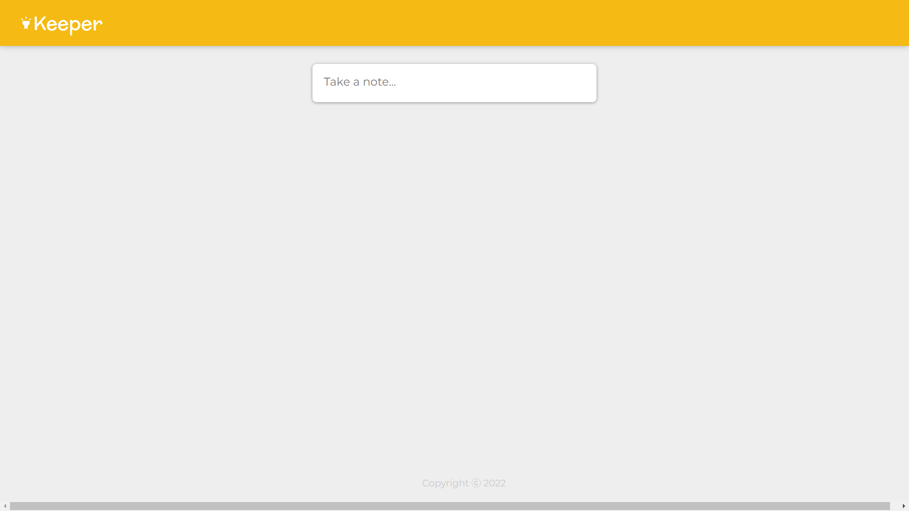
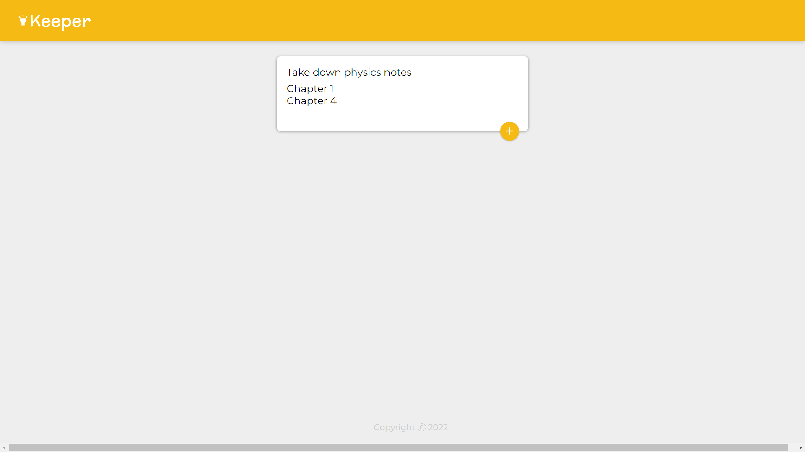
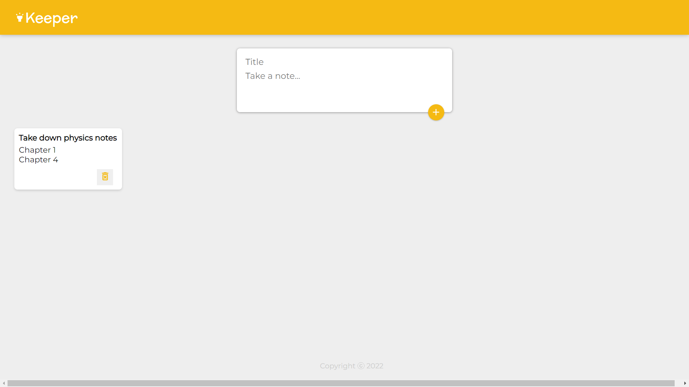
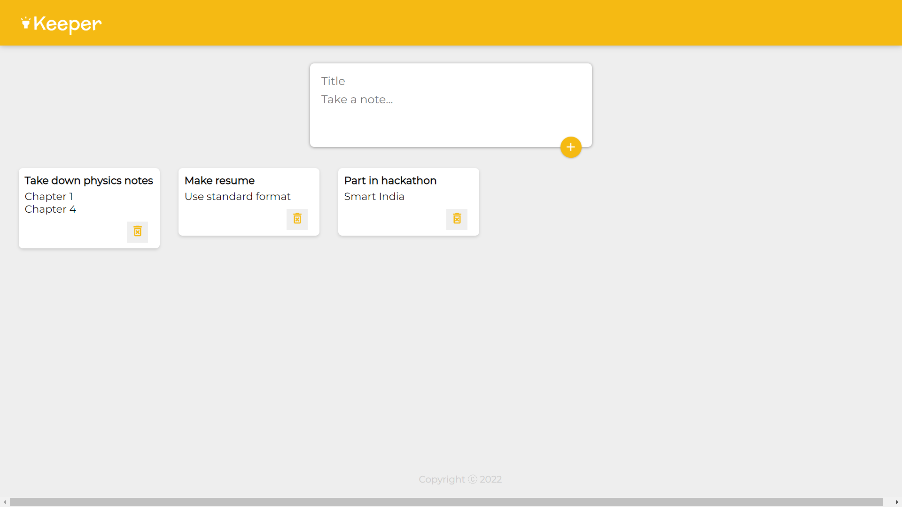
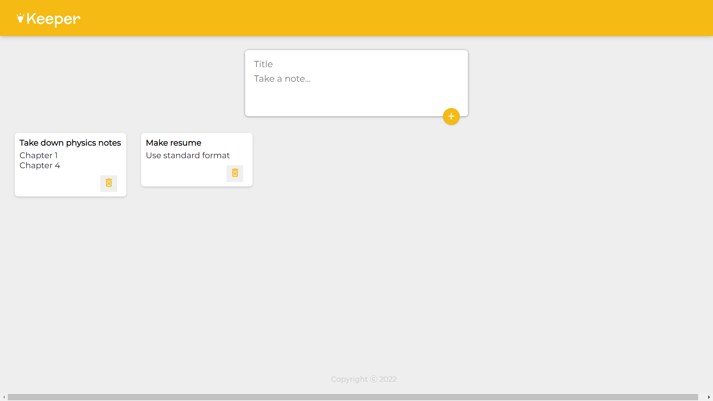

# Notes app
This is a react app that allows you to write notes.
It is not a full-fledged app, but a frontend for a full-fledged app.

## Features of react used:
1. React components
2. React States
3. React Hooks
4. React Functional Components 
and more...

## Some screenshots
Textbox for note

Expanded textbox

Note added

Few notes added

Note deleted

This project was covered in the following course:
Complete Web Development Bootcamp 2022